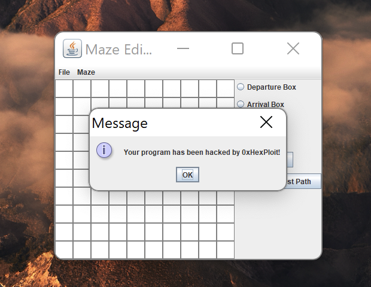

# MAZE
## Final Java Project - Telecom Paris

### Description
The aim of this project was to apply all the knowledge acquired 
during the Java course at Telecom Paris. The purpose of the project
is to allow the user to create a maze and to find out if it is possible 
to reach the arrival point from the starting point using Dijkstra's algorithm.

### Visualisation
Here below is a UML visualisation that describes how certain classes are
related to each other.


### Run
To run the project, you will have to download the following file `MAZE_HUGO_PEYRON_TELECOM_PARIS.zip
`. The latter can be found in the release section of this repository.

Once downloaded, you will have to unzip the file and run the following command in the terminal:
```
java -jar Maze.jar ./maze.properties
```

The `maze.properties` file is the configuration file of the project. It contains the following parameters:
```
maze.height=10
maze.width=10
maze.persistence.use_serialization=true
maze.logs.saveToFile=false
maze.logs.path=logs.txt
```

In case you would like to see how a maze is represented in a text file, 
you can change the `maze.persistence.use_serialization` parameter to `false`.


### Test
I/O tests are available in the `test` folder. To run them, you will have to run the following command in the terminal:
```
mvn test
```

### Hacking 

This repository contains also a branch named `hacking`. The latter contains a modified version of the project that permits to run the program with an old version of the JRE (`version 1.7`). This allowed us to discover a deserialization vulnerability using the `Apache Commons Collections (version 3.2.2)` framework. As we can see below, we managed to open
a JOptionPane saying that we hacked the Maze Program.




In case you would like to execute an external program instead of displaying a message to the user, execute the following
steps:
 - Open the `HackedSerializedDataGenerator.java` located inside the `com.telecom.paris.hacking` package.
 - Uncomment the transformation chain that permits to call an external program.
 - Execute this file as a Java Application (the program expects a command line argument: the path towards the external program).

### Remarks
The UI part of the application was not implemented by myself but by another student of Telecom Paris.

### Authors
This project was developed by **Hugo Peyron** (Cybersecurity and Cyberdefense student at Telecom Paris).
